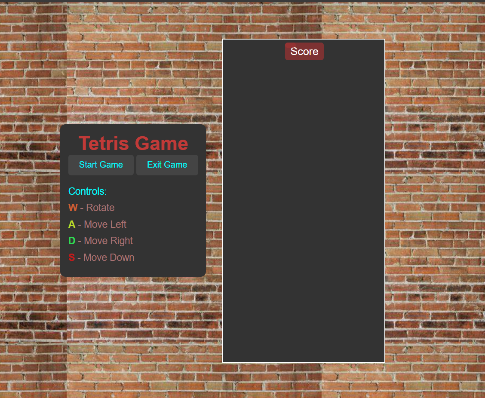

# Tetris Game

A simple Tetris game built using HTML5, CSS3, and JavaScript. This classic arcade game features a user interface with buttons to start and exit the game, as well as a scoreboard to track your progress. The game includes basic controls, including the ability to rotate and move the falling pieces.


## Features
- **Tetris Gameplay**: Rotate, move, and stack falling blocks.
- **Score Tracking**: Displays your current score based on cleared lines.
- **Game Controls**: 
    - **W**: Rotate the piece.
    - **A**: Move the piece left.
    - **D**: Move the piece right.
    - **S**: Move the piece down faster.
- **Start & Exit Buttons**: Allows you to start a new game or exit the game.

## How to Play
1. **Start the Game**: Press the "Start Game" button to begin playing.
2. **Control the Pieces**:
    - **W**: Rotate the current piece.
    - **A**: Move the current piece to the left.
    - **D**: Move the current piece to the right.
    - **S**: Move the current piece down faster.
3. **Clear Lines**: Complete horizontal lines to clear them and earn points.
4. **Game Over**: The game ends when a new piece cannot be placed because of the filled board.


## Installation

To play the game, follow these steps:

1. **Clone this repository** to your local machine:

   ```bash
   git clone https://github.com/BNB2006/Tetris-Game.git
